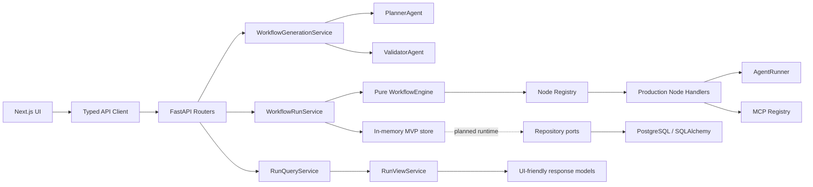

# Architecture

FlowPilot MCP is a lightweight AI workflow automation engine. It converts natural-language automation requests into executable workflow graphs, executes them through agent abstractions and MCP-style tool clients, persists run state and artifacts, and adds human approval before risky actions.

The current MVP is centered on a GitHub Repository Audit workflow. The architecture is intentionally modular so graph execution stays testable and independent from HTTP, persistence, agents, and external tools.

## System Diagram

## Runtime Layers

### Frontend

The frontend is a product workspace:

- generates workflows from a prompt and GitHub URL
- renders the graph as custom React Flow nodes
- polls run state
- surfaces approval actions
- displays reports, timeline, logs, node results, and raw debug output

### API Layer

FastAPI routes are intentionally thin. They validate requests, delegate to services, and return typed Pydantic response models. Structured API errors include:

- `code`
- `message`
- `details`
- `severity`
- `retryable`

### Service Layer

Services coordinate work across the domain engine, agents, MCP clients, approval records, artifacts, and response view models.

Key services:

- `WorkflowGenerationService`: planner + validator + persisted workflow entry
- `WorkflowRunService`: creates and executes run state
- `RunQueryService`: returns raw and UI-friendly run responses
- `RunViewService`: computes summaries, timeline, approval panel data, artifact tab state, and `ui_state`
- `ApprovalService`: records approve/reject decisions and resumes or skips guarded work
- `ArtifactService`: persists artifact payloads emitted by report nodes

### Workflow Domain

`backend/app/workflow/` is kept pure:

- graph validation
- deterministic topological sorting
- node state transitions
- retry and timeout behavior
- approval pause/resume
- cascade skip behavior
- input resolution from dependency outputs

It does not import FastAPI, SQLAlchemy, MCP, or agent modules.

### Agent Layer

Agents are wrappers around a shared `AgentRunner`. The runner loads versioned prompts, invokes a selected backend, validates strict Pydantic output, retries transient errors, and reprompts once after invalid output.

### MCP-style Tool Layer

MCP-style clients are hidden behind ports and a registry. GitHub and filesystem clients default to mock mode. The OpenAI MCP client is explicit unavailable mode when no MCP server URL is configured.

## Persistence Status

The MVP API currently uses an in-process store for workflow/run/approval/artifact data. SQLAlchemy models, migrations, repository ports, repository implementations, and integration tests exist, but the API runtime has not yet been fully switched to durable repository-backed persistence.

This is why local non-Docker health can show non-blocking `Memory mode`, while Docker Compose expects PostgreSQL to be available and healthy.

## Backend-Driven UI State

The API returns additive UI-friendly fields while preserving raw outputs:

- workflow `summary`
- workflow `node_display`
- run `summary`
- run `timeline`
- run `approval`
- run `artifact_tabs`
- run `node_results`
- run `ui_state`

The frontend uses these fields first and falls back to raw outputs only when needed.

## Design Boundaries

- Workflow engine remains framework-independent.
- Services coordinate side effects.
- Agents transform and validate AI-generated content.
- MCP clients handle external tool access.
- API routes do not contain business logic.
- UI-only response fields are computed, not persisted.
