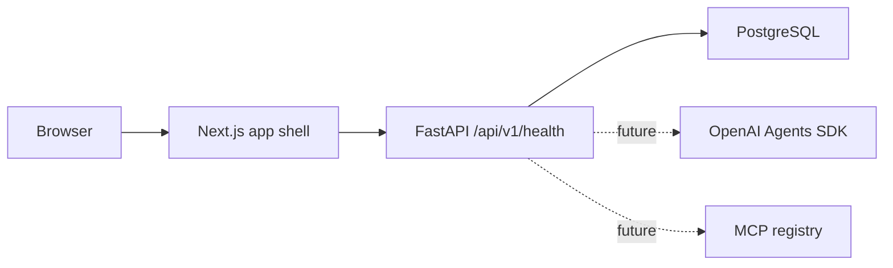

# FlowPilot MCP Architecture

## Phase 0

The current codebase establishes the target folder layout and runnable service shells.

## Design Decisions

- Health returns `not_configured` for OpenAI when no API key is present. This keeps local development bootable while making the missing integration explicit.
- Later workflow logic will live under `backend/app/workflow/` without FastAPI, database, or transport dependencies.
