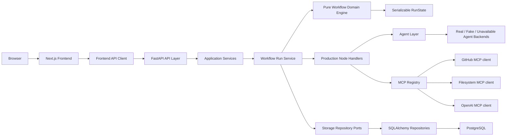

# FlowPilot MCP Architecture

## Current Architecture

The current codebase has completed the scaffold, workflow domain, persistence models, MCP adapter layer, agent abstraction layer, production node handlers, and the backend MVP API contract. Frontend workflow screens are the next implementation layer.

## Design Decisions

- Health returns `not_configured` for OpenAI when no API key is present. This keeps local development bootable while making the missing integration explicit.
- Later workflow logic will live under `backend/app/workflow/` without FastAPI, database, or transport dependencies.
- Persistence is attached outside the domain core through repository ports in `backend/app/storage/ports.py`. SQLAlchemy implementations live under `backend/app/storage/repositories/`, and `backend/app/workflow/` remains free of SQLAlchemy, FastAPI, HTTP, MCP, and agent imports.
- Node execution input snapshots are defined by `resolve_node_inputs`: static node config plus a reserved `_dependencies` map of upstream outputs. This is the contract Phase 2 persists as `input_snapshot_json`.
- MCP clients sit behind `ToolClientPort` and are resolved through `ToolClientRegistry`. GitHub/filesystem mock-vs-real selection happens only in `app/mcp/registry.py`; OpenAI MCP distinguishes `REAL`, `MOCK`, and `UNAVAILABLE` client modes so absent configuration is not confused with fake data.
- Agents sit behind `AgentPort` and are invoked through `AgentRunner`. The runner owns prompt loading, backend-mode selection, retry/timeout composition, validation reprompting, and strict output parsing. Tests use deterministic fake/unavailable backends and never call the real OpenAI API.
- Production node handlers live under `backend/app/workflow/nodes/` and are registered through the existing node registry. They convert agent/MCP failures into controlled node failure results and keep mock mode explicit in outputs.
- Human approval persistence and markdown artifact persistence are coordinated by services around the workflow engine. The handler emits the approval/artifact intent; services persist and expose it through API responses.
- The Phase 6 MVP API uses deterministic in-process persistence for local E2E tests while the SQLAlchemy repositories remain available for the database-backed persistence layer.

## Boundaries

- Domain engine, graph, state, and input resolution stay pure and live under `backend/app/workflow/`.
- Services coordinate persistence and workflow execution.
- Node handlers call agents and MCP clients.
- Agents handle AI transformations and output validation.
- MCP clients handle external tool access.
- API routes validate requests and delegate to services.
- Frontend code consumes API responses and renders workflow state.
