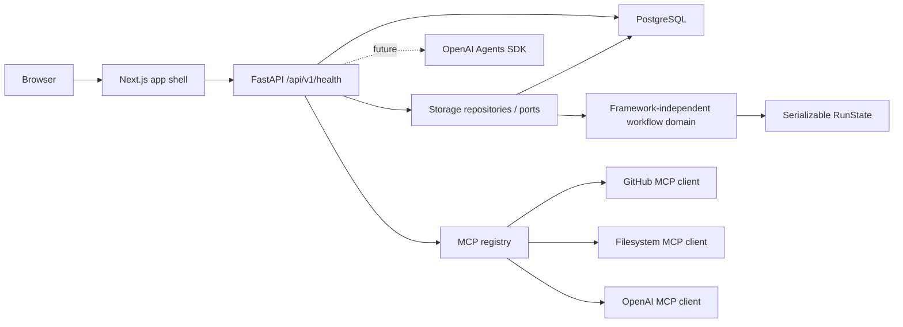

# FlowPilot MCP Architecture

## Phase 0

The current codebase establishes the target folder layout and runnable service shells.

## Design Decisions

- Health returns `not_configured` for OpenAI when no API key is present. This keeps local development bootable while making the missing integration explicit.
- Later workflow logic will live under `backend/app/workflow/` without FastAPI, database, or transport dependencies.
- Persistence is attached outside the domain core through repository ports in `backend/app/storage/ports.py`. SQLAlchemy implementations live under `backend/app/storage/repositories/`, and `backend/app/workflow/` remains free of SQLAlchemy, FastAPI, HTTP, MCP, and agent imports.
- Node execution input snapshots are defined by `resolve_node_inputs`: static node config plus a reserved `_dependencies` map of upstream outputs. This is the contract Phase 2 persists as `input_snapshot_json`.
- MCP clients sit behind `ToolClientPort` and are resolved through `ToolClientRegistry`. GitHub/filesystem mock-vs-real selection happens only in `app/mcp/registry.py`; OpenAI MCP distinguishes `REAL`, `MOCK`, and `UNAVAILABLE` client modes so absent configuration is not confused with fake data.
